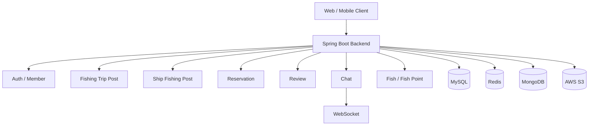
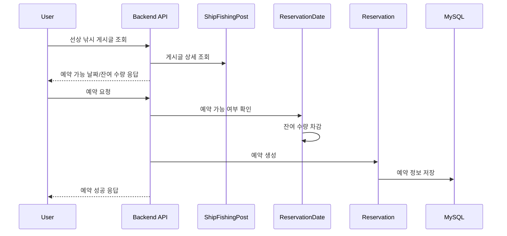
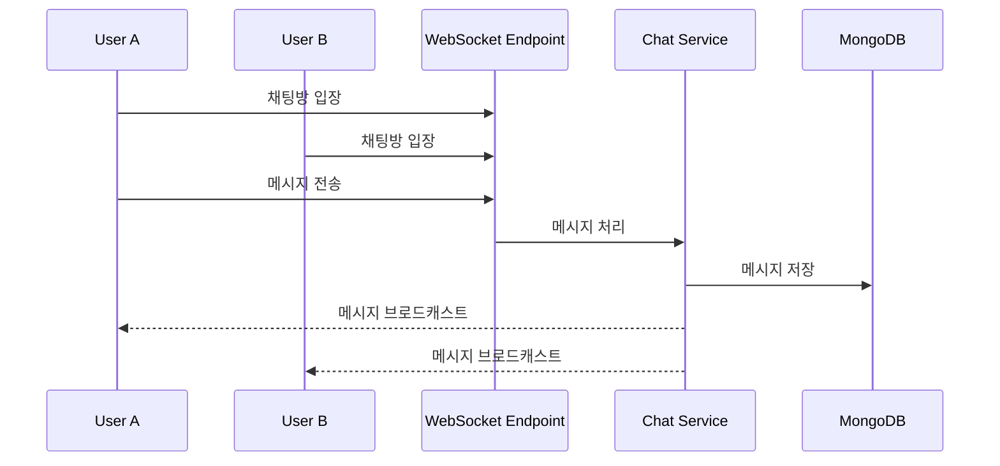

# WEB3_4_8BIT_BE

> 프로그래머스 최종 프로젝트로 진행한 낚시 서비스 백엔드입니다.

이 프로젝트는 낚시 포인트, 어종 정보, 선상 낚시 게시글, 출조 모집, 예약, 리뷰, 채팅, 좋아요, 회원 인증 등을 제공하는 낚시 플랫폼 백엔드입니다. Spring Boot 기반의 단일 백엔드 애플리케이션으로 구성되어 있으며, JPA/QueryDSL, Redis, MongoDB, WebSocket, OAuth2/JWT, S3, 공간 데이터 처리를 활용합니다.

---

## 1. 프로젝트 개요

낚시 활동은 포인트 정보, 어종 정보, 선박/출조 정보, 예약, 후기, 모집 커뮤니티가 분산되어 있어 사용자가 정보를 찾기 어렵습니다. 이 프로젝트는 낚시 관련 정보를 한 곳에서 탐색하고, 출조 모집과 선상 낚시 예약까지 연결할 수 있도록 구성한 백엔드 서비스입니다.

### 주요 목표

- 낚시 포인트와 어종 정보를 제공
- 선상 낚시 게시글과 출조 모집 게시글 관리
- 예약 가능 날짜와 예약 기능 제공
- 게시글 댓글, 좋아요, 리뷰 기능 제공
- 실시간 채팅 기능 제공
- OAuth2/JWT 기반 사용자 인증
- Redis 캐싱 및 MongoDB 기반 채팅 데이터 처리
- QueryDSL과 공간 데이터 기반 검색 확장

---

## 2. 기술 스택

| 구분 | 기술 |
|---|---|
| Language | Java 17 |
| Framework | Spring Boot 3.4.4 |
| Build | Gradle |
| Persistence | Spring Data JPA |
| Database | MySQL, H2 |
| Query | QueryDSL, QueryDSL Spatial |
| Cache | Redis |
| Document DB | MongoDB |
| Realtime | WebSocket |
| Security | Spring Security, OAuth2 Client, JWT |
| API Docs | SpringDoc OpenAPI / Swagger UI |
| Storage | AWS S3 SDK |
| Spatial | JTS Core, Hibernate Spatial |
| Test | JUnit, Spring Boot Test, Fixture Monkey |
| Logging | Logback |
| Etc | Lombok, Validation, Mail, AOP, Retry |

---

## 3. 프로젝트 구조

```text
WEB3_4_8BIT_BE
└── backend
    ├── Dockerfile
    ├── build.gradle
    ├── settings.gradle
    └── src
        ├── main
        │   ├── java/com/backend
        │   │   ├── BackendApplication.java
        │   │   ├── domain
        │   │   │   ├── activityhistory
        │   │   │   ├── auth
        │   │   │   ├── captain
        │   │   │   ├── catchmaxlength
        │   │   │   ├── chat
        │   │   │   ├── comment
        │   │   │   ├── fish
        │   │   │   ├── fishencyclopedia
        │   │   │   ├── fishingtrippost
        │   │   │   ├── fishingtriprecruitment
        │   │   │   ├── fishpoint
        │   │   │   ├── fishpointsummary
        │   │   │   ├── like
        │   │   │   ├── member
        │   │   │   ├── region
        │   │   │   ├── reservation
        │   │   │   ├── reservationdate
        │   │   │   ├── review
        │   │   │   ├── ship
        │   │   │   └── shipfishingpost
        │   │   └── global
        │   │       ├── advice
        │   │       ├── aop
        │   │       ├── auth
        │   │       ├── config
        │   │       ├── event
        │   │       ├── exception
        │   │       ├── scheduler
        │   │       ├── storage
        │   │       ├── util
        │   │       ├── validator
        │   │       └── websocket
        │   └── resources
        │       └── logback-spring.xml
        └── test
```

---

## 4. 전체 아키텍처



---

## 5. 핵심 도메인

| 도메인 | 설명 |
|---|---|
| `member` | 회원 정보, 인증 사용자 관리 |
| `auth` | 로그인, OAuth2, JWT 인증 흐름 |
| `fish` | 어종 정보 관리 |
| `fishencyclopedia` | 어종 백과/상세 정보 |
| `fishpoint` | 낚시 포인트 정보 |
| `fishpointsummary` | 포인트 요약 정보 |
| `fishingtrippost` | 출조/낚시 동행 게시글 |
| `fishingtriprecruitment` | 출조 모집 관리 |
| `ship` | 선박 정보 |
| `shipfishingpost` | 선상 낚시 게시글 |
| `reservation` | 예약 처리 |
| `reservationdate` | 예약 가능 날짜/잔여 수량 관리 |
| `review` | 예약/서비스 후기 |
| `comment` | 게시글 댓글 |
| `like` | 게시글 좋아요 |
| `chat` | 실시간 채팅 |
| `region` | 지역 정보 |
| `captain` | 선장/운영자 관련 정보 |
| `activityhistory` | 사용자 활동 이력 |
| `catchmaxlength` | 어종별 최대어 기록 관리 |

---

## 6. 주요 기능

### 회원/인증

- Spring Security 기반 인증/인가
- OAuth2 Client 기반 소셜 로그인 확장
- JWT 기반 인증 토큰 처리
- 이메일 기능 확장 가능

### 낚시 정보

- 어종 정보 조회
- 어종 백과 정보 관리
- 낚시 포인트 및 지역 기반 검색
- 공간 데이터 기반 위치 검색 확장

### 게시글/커뮤니티

- 출조 모집 게시글 작성/조회/수정/삭제
- 선상 낚시 게시글 작성/조회/수정/삭제
- 댓글/좋아요 기능
- 사용자 활동 이력 관리

### 예약

- 선상 낚시 게시글 기반 예약
- 예약 가능 날짜 관리
- 잔여 수량 관리
- 예약 후 리뷰 작성 흐름 확장

### 채팅

- WebSocket 기반 실시간 채팅
- MongoDB 기반 채팅 메시지 저장 구조 확장

### 운영/공통

- Global Exception Handling
- 공통 응답 DTO
- AOP 기반 공통 로직 분리
- Scheduler 기반 집계/후처리 확장
- Logback 기반 로그 설정
- S3 파일 저장소 연동 구조

---

## 7. 예약 흐름



---

## 8. 채팅 흐름



---

## 9. 실행 방법

### 1) 백엔드 디렉터리 이동

```bash
cd backend
```

### 2) 빌드

```bash
./gradlew clean build
```

Windows 환경:

```bash
gradlew.bat clean build
```

### 3) 실행

```bash
./gradlew bootRun
```

또는 JAR 실행:

```bash
java -jar build/libs/backend-0.0.1-SNAPSHOT.jar
```

---

## 10. 환경 변수 예시

실제 secret 값은 Git에 올리지 않고 환경 변수 또는 배포 환경 secret으로 관리하는 것을 권장합니다.

```yaml
spring:
  datasource:
    url: jdbc:mysql://localhost:3306/fishing_service
    username: root
    password: ${DB_PASSWORD}

  data:
    redis:
      host: localhost
      port: 6379

    mongodb:
      uri: ${MONGODB_URI}

jwt:
  secret: ${JWT_SECRET}

cloud:
  aws:
    credentials:
      access-key: ${AWS_ACCESS_KEY}
      secret-key: ${AWS_SECRET_KEY}
    s3:
      bucket: ${S3_BUCKET}
```

---

## 11. API 문서

SpringDoc OpenAPI가 포함되어 있으므로 실행 후 Swagger UI를 통해 API를 확인할 수 있습니다.

```text
http://localhost:8080/swagger-ui/index.html
```

---

## 12. 테스트 포인트

| 영역 | 테스트 시나리오 |
|---|---|
| 인증 | 로그인 성공/실패, JWT 검증, 인증 필요 API 접근 제한 |
| 게시글 | 게시글 생성/조회/수정/삭제, 검색 조건 필터링 |
| 예약 | 잔여 수량 차감, 중복 예약 방지, 예약 가능 날짜 검증 |
| 리뷰 | 예약 완료 사용자만 리뷰 작성 가능 여부 |
| 좋아요 | 중복 좋아요 방지, 좋아요 취소 |
| 채팅 | 메시지 전송, 메시지 저장, 채팅방 입장/퇴장 |
| 검색 | QueryDSL 기반 조건 검색, 위치 기반 검색 |
| 파일 | 이미지 업로드, S3 저장 실패 처리 |

---


